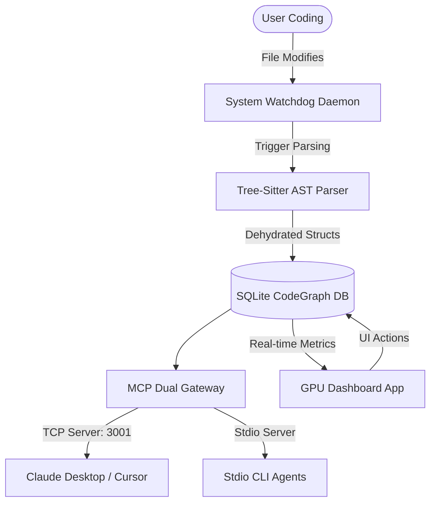

# Dehydrator4Win

> [!NOTE]  
> **中文版本**：本项目提供了完整的中文文档，请点击 [README_zh.md](./README_zh.md) 切换阅读。

Dehydrator4Win is a pure-Rust, high-performance, non-Chromium AI Context OS designed to bypass redundancy and optimize context token metrics for Large Language Model (LLM) agents and coding assistants. By intercepting code reads, generating skeleton AST outlines, and managing dependencies, Dehydrator4Win keeps your LLM contexts dry, fast, and cost-efficient.


---

## Key Features

1. **Reactive Telemetry Dashboard (Non-Chromium)**  
   Built using the native Rust UI library `Iced`. Operates as a GPU-accelerated desktop dashboard without HTML/CSS engines or Chromium runtimes, retaining a ultra-low memory footprint.
2. **Dual-Channel MCP Gateway**  
   Exposes both `stdio` and `TCP (127.0.0.1:3001)` model context protocol (MCP) server endpoints, enabling tools like Claude Desktop, Cursor, and custom local agents to seamlessly interact with your codebase index.
3. **Automatic filesystem Watchdog**  
   Maintains a background system watchdog monitoring modified files, triggering AST incremental re-parsing and CodeGraph index updates instantly.
4. **Context Dehydration Engine**  
   Processes Rust and Python source files exceeding user-defined limits (e.g., 100 lines), stripping function/method implementations to create structural skeletons while keeping function signatures, docstrings, and classes intact.
5. **AI Skills Injection**  
   Injects customized agent directives and skeleton contracts into target workspaces (`.codex`, `.claude`, `.gemini`, `.agent` directories), streamlining agent behaviors automatically.

---

## Architectural Layout



---

## Getting Started & Compilation

### Prerequisites
- Install the Rust toolchain: [rustup.rs](https://rustup.rs/) (Ensure Cargo is in your system PATH).
- Git tool installed.

### Step 1: Clone the Repository
```bash
git clone https://github.com/MRDHR/Dehydrator4Win.git
cd Dehydrator4Win
```

### Step 2: Build the Executable
To compile the production-ready optimized binary:

> [!WARNING]  
> **Windows File Lock Error**: If you run `cargo build --release` and get a permission error `拒绝访问 (os error 5)`, it means a background instance of `Dehydrator4Win.exe` is running and locking the output file. 
> 
> Before compiling, run this command in your terminal to release the lock:
> ```powershell
> taskkill /f /im Dehydrator4Win.exe
> ```

Run the release compilation command:
```bash
cargo build --release
```
The compiled executable will be located at: `target/release/Dehydrator4Win.exe`.

### Step 3: Run Unit Tests
To verify all features (including Tree-Sitter loading, database queries, and watchdogs) are fully functional:
```bash
cargo test
```

---

## Usage Guide

### 1. GUI Mode (Default)
Simply run the compiled executable (or compile and run via Cargo):
```bash
cargo run --release
```
The GUI dashboard will launch **centered on your screen**. In release mode, the terminal window is hidden.

* **Top Control Card**: Shows your total token savings (intercepted redundant lines), and computes real-time aggregates:
  * **Raw Overhead Ceiling**: Total tokens that would be read if full files were sent.
  * **Dehydrated Spent Floor**: Actual tokens read with skeleton structures.
  * **Net Intercept Efficiency**: Real-time context saving ratio (%).
* **Timeframe Buttons**: Quickly switch analytics ranges (`24H`, `3D`, `7D`, `15D`, `30D`). The chart and metrics will update instantly.
* **Workspace profiles**: Add directories to your active profile, and click **Scan** to perform parallel Tree-Sitter AST symbol extraction.
* **AI Skills**: Click **ACTIVATE AI SKILLS** to automatically write developer configurations into the project workspace.

### 2. Headless Daemon Mode
If you prefer running Dehydrator4Win as a background CLI daemon (e.g., in headless build servers or Docker environments):
```bash
target/release/Dehydrator4Win.exe --headless
```
This runs the MCP server on stdio and starts the 127.0.0.1:3001 TCP host without launching the Iced GUI.

---

## License
Licensed under the Apache License 2.0. Feel free to contribute or submit PRs!
