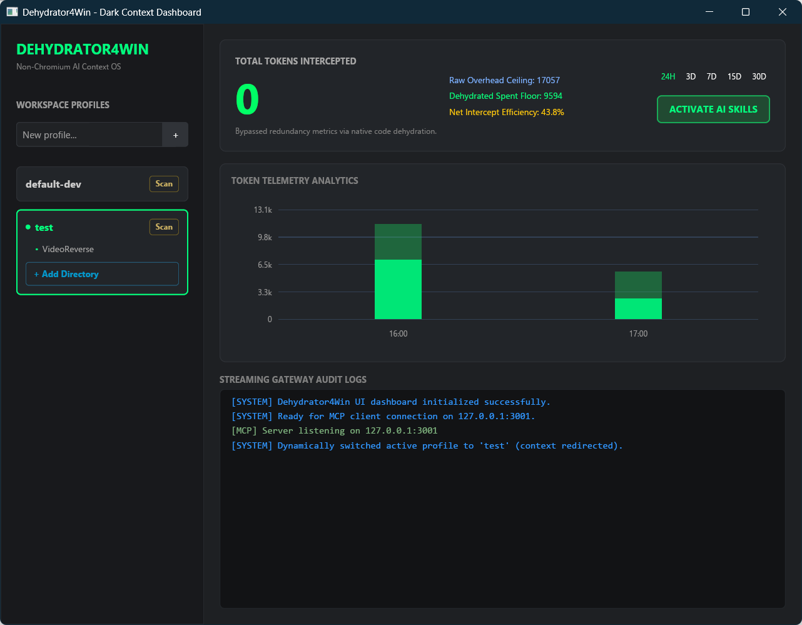
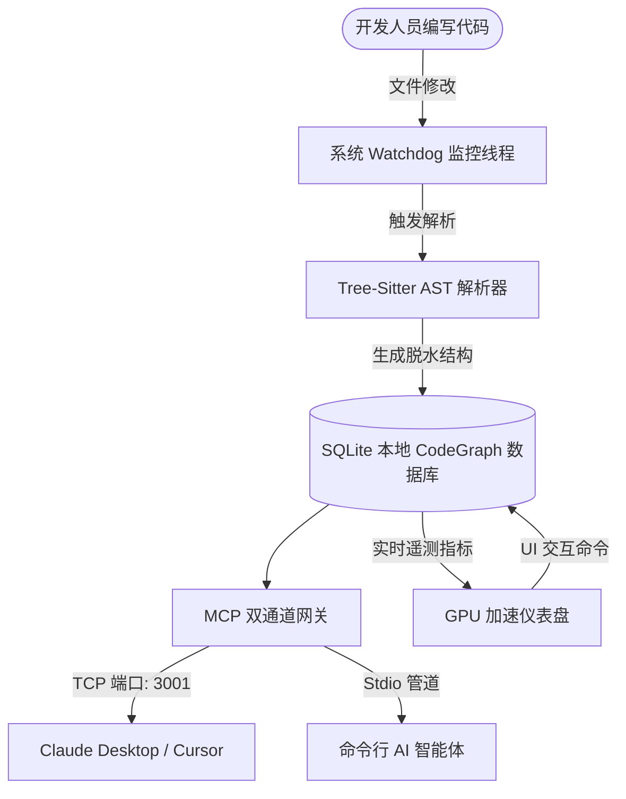

# Dehydrator4Win

> [!NOTE]  
> **English Version**: This project provides a full English document. Please click [README.md](./README.md) to read it.

Dehydrator4Win 是一个使用纯 Rust 开发的、高性能且**不依赖 Chromium/Web 渲染器**的 AI 上下文操作系统。旨在通过在后台拦截文件读取、生成骨架 AST 大纲以及管理符号依赖关系，帮助大型语言模型（LLM）智能体与编程助手规避重复庞杂的源码上下文，让 LLM 上下文保持精简、快速且具备极高的性价比。



---

## 核心特性

1. **响应式遥测仪表盘（无 Chromium）**  
   使用 Rust 原生 GUI 库 `Iced` 构建。运行为 GPU 加速的原生桌面仪表盘，不携带 HTML/CSS 解析引擎或庞大的 Chromium 运行时，拥有极低的运行内存占用。
2. **双通道 MCP 协议网关**  
   同时暴露 `stdio` 标准输入输出与 `TCP (127.0.0.1:3001)` 两大模式上下文协议（MCP）服务端，使 Claude Desktop、Cursor 或是自定义的本地智能体能够无缝接入您的代码符号库。
3. **文件系统自动监控守护 (Watchdog)**  
   后台自动监听被修改的源代码文件，触发 Tree-Sitter 增量式 AST 重解析并实时更新本地 CodeGraph。
4. **上下文脱水（Dehydration）引擎**  
   对超过指定长度（例如 100 行）的 Rust/Python 源文件进行脱水处理：剔除内部具体的函数/方法体实现，但完整保留函数签名、类结构及 Docstring 注释。
5. **AI 智能体 Skill 自动注入**  
   自动将智能体指令和结构大纲契约写入绑定的工作空间目录中（支持 `.codex`、`.claude`、`.gemini`、`.agent`），以此指导 AI 智能体规范操作。

---

## 系统架构



---

## 快速上手与编译指南

### 准备环境
- 安装 Rust 工具链：[rustup.rs](https://rustup.rs/)（确保 Cargo 已加入系统的环境变量 PATH 中）。
- 已安装 Git 版本控制工具。

### 第一步：克隆仓库
```bash
git clone https://github.com/MRDHR/Dehydrator4Win.git
cd Dehydrator4Win
```

### 第二步：编译 Release 生产包
如需编译经过高度优化、适合日常常驻运行的二进制程序：

> [!WARNING]  
> **Windows 下文件锁报错**：如果您在运行 `cargo build --release` 时遇到了拒绝对 `Dehydrator4Win.exe` 写入的权限错误 `拒绝访问 (os error 5)`，说明您在此前已经运行了本程序的后台实例锁定了目标文件。
> 
> 在重新编译前，请在终端执行以下命令释放文件锁：
> ```powershell
> taskkill /f /im Dehydrator4Win.exe
> ```

运行 Release 构建指令：
```bash
cargo build --release
```
编译产物可执行文件将输出至：`target/release/Dehydrator4Win.exe`。

### 第三步：运行单元测试
运行内置单元测试，确保 Tree-Sitter 加载、数据库时区、文件监控等 12 项组件工作正常：
```bash
cargo test
```

---

## 使用指南

### 1. GUI 可视化模式（默认）
直接运行编译生成的 exe 文件（或者通过 Cargo 编译并直接运行）：
```bash
cargo run --release
```
运行后主界面将**默认居中在屏幕正中央**。在 Release 模式下，多余的黑色控制台命令行窗口会被自动隐藏。

* **顶部核心控制卡**：显示截获的总 Token 节省量，并实时汇总三项硬指标：
  * **Raw Overhead Ceiling (原始开销上限)**：若将完整源码直接发送给 LLM 所产生的理论 Token 总开销。
  * **Dehydrated Spent Floor (脱水消耗下限)**：通过提取骨架结构实际发送给 LLM 的实际 Token 开销。
  * **Net Intercept Efficiency (净截获效率比)**：实时帮您节省的上下文比例（%）。
* **时间段过滤按钮**：点击卡片右侧的 `24H`、`3D`、`7D`、`15D`、`30D` 按钮，图表和实时指标将立即响应刷新。
* **工作区 Profile 列表**：在左侧列表中可输入新建 Profile 并绑定本地文件夹，点击 **Scan** 会自动启动并行解析和 CodeGraph 索引生成。
* **智能体 Skill 注入**：点击卡片右侧的 **ACTIVATE AI SKILLS** 按钮，系统会自动将智能体指导文件注入进对应的工作空间中。

### 2. Headless 后台无界面模式
如果您想在没有图形桌面的服务器、Docker 容器中运行，或作为隐蔽守护进程运行，可以使用 `--headless` 命令行参数：
```bash
target/release/Dehydrator4Win.exe --headless
```
该模式会作为 `stdio` 的 MCP 适配器，同时在后台静默开启 127.0.0.1:3001 端口的 TCP 协议服务端，但不启动任何 Iced GUI 图形化渲染组件。

---

## MCP 客户端接入配置

Dehydrator4Win 在同一个端口 `127.0.0.1:3001` 上**同时支持两种 MCP 传输协议**：

| 客户端 | 传输协议 | 接入端点 |
|---|---|---|
| Claude Desktop（Anthropic） | Streamable HTTP（2025-03-26 规范） | `http://127.0.0.1:3001/mcp` |
| GPT / OpenAI | HTTP+SSE（2024-11-05 规范） | `http://127.0.0.1:3001/sse` |
| 自定义 stdio 智能体 | stdio 标准输入输出 | 使用 `--headless` 启动 |

### Claude Desktop
在您的 `claude_desktop_config.json` 中添加以下配置：
```json
{
  "mcpServers": {
    "dehydrator4win": {
      "type": "http",
      "url": "http://127.0.0.1:3001/mcp"
    }
  }
}
```

### GPT / OpenAI（SSE）
使用 SSE 协议端点：
```
http://127.0.0.1:3001/sse
```

### Cursor / VS Code（stdio）
在您的 MCP 配置文件中加入：
```json
{
  "mcpServers": {
    "dehydrator4win": {
      "command": "C:/path/to/Dehydrator4Win.exe",
      "args": ["--headless"]
    }
  }
}
```

---

## 许可证
基于 Apache License 2.0 许可证开源，欢迎大家提 PR 或 Issue 共同改进！
